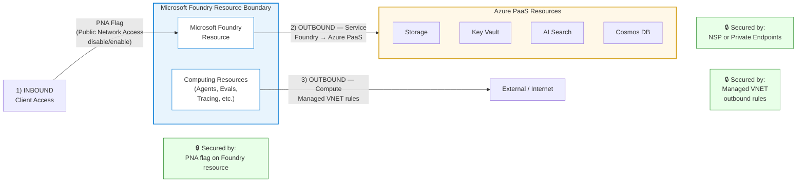
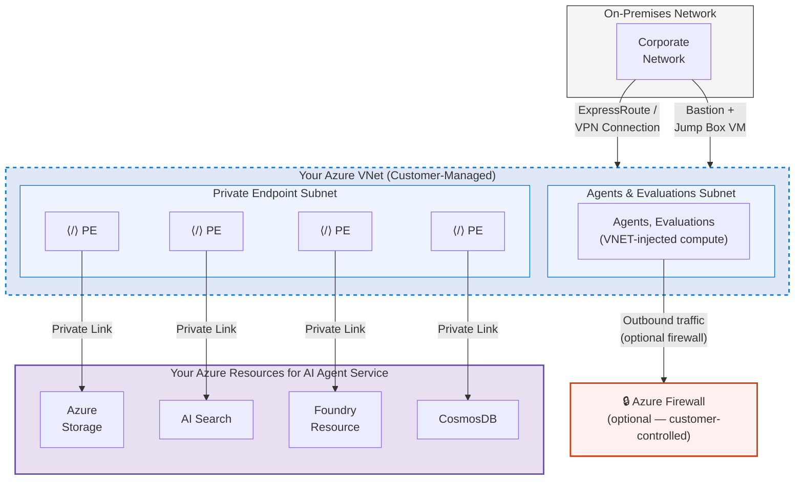
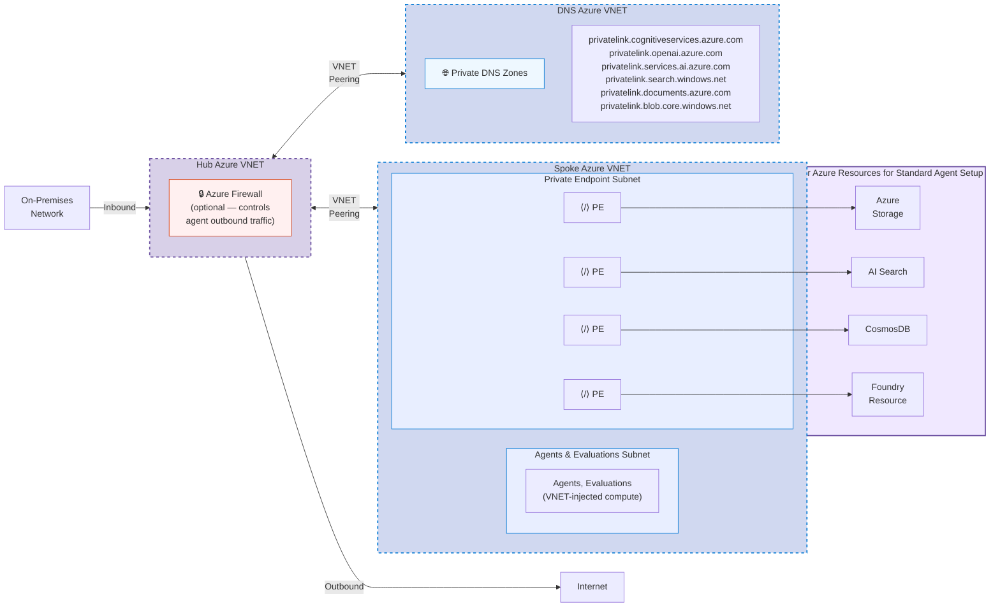
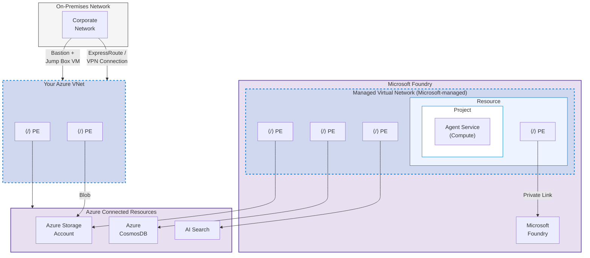

# Network Isolation — Domain Knowledge

## When to Use This Skill

- User asks about VNET configuration, private endpoints, NSP, or managed VNET for Microsoft Foundry 
- Triaging a customer blocker related to network isolation
- Drafting a spec or work item for a network isolation feature
- Reviewing a customer's network architecture for Foundry deployment
- Assessing enterprise readiness for network isolation features

## Do NOT Use This Skill For

- Pricing, quota, or capacity questions (Foundry Offers domain)
- General Azure networking unrelated to AI Foundry
- Authentication or identity questions (→ `unified-endpoint-auth` area)
- Encryption or CMK questions (→ `encryption-cmk` area)

---

## Architecture Overview

Network isolation in Microsoft Foundry breaks down into **three traffic paths** — one inbound and two outbound:

| # | Path | Direction | Secured By |
|---|------|-----------|------------|
| 1 | Client → Foundry Resource | **Inbound** | PNA flag (Public Network Access disable/enable) |
| 2 | Foundry → Azure PaaS (Storage, Key Vault, AI Search, etc.) | **Outbound — Service** | NSP or Private Endpoints |
| 3 | Compute (Agents, Evals, Tracing) → External | **Outbound — Compute** | Managed VNET outbound rules |

---

## Deployment Architecture Patterns

### Pattern 1: Custom (BYO) VNET Setup

Customer-managed VNET where Foundry compute is injected directly into the customer's network. The customer has full control over outbound traffic and can optionally deploy an Azure Firewall.

| Component | Description |
|-----------|-------------|
| **Inbound** | Private endpoints in dedicated PE subnet connecting to each Azure PaaS resource |
| **Compute** | Agents & Evaluations VNET-injected into a separate subnet within customer's VNET |
| **Outbound** | Customer-controlled — optional Azure Firewall for agent outbound traffic |
| **On-prem** | ExpressRoute/VPN and Bastion jump box |

### Pattern 2: Hub-and-Spoke BYO VNET Architecture

Enterprise-grade hub-and-spoke topology for BYO VNET deployments. Separates concerns across three VNETs: hub (firewall/traffic control), spoke (Foundry compute + PEs), and DNS (private zone resolution).

| VNET | Purpose |
|------|---------|
| **Hub** | Firewall for controlling inbound (on-prem) and outbound (internet) traffic |
| **Spoke** | Agents/Evaluations compute subnet (VNET-injected) + Private Endpoint subnet for Azure PaaS |
| **DNS** | Private DNS zones for all private link domains (cognitiveservices, openai, AI services, search, documents, blob) |

All three VNETs connected via **VNET Peering**.

### Subnet Sizing & IP Allocation

This guidance applies **instance-wide** across all agent types (Hosted and Prompt). Both share the same delegated subnet and underlying ACA infrastructure.

| Parameter | Value |
|-----------|-------|
| **Recommended subnet** | /24 CIDR (251 usable IPs) |
| **Minimum viable** | /27 (27 usable) — risky above ~200 agents |
| **Instance cap (preview)** | ~250 projects per Foundry instance (all agent types combined) |
| **Hosted agent limit** | ~200 hosted agents per instance |
| **Hosted revision limits** | 100 active / 1,000 total per agent |
| **Prompt agent revision limit** | 1,000 total per agent |
| **Reserved range** | Do NOT use 172.17.0.0/16 (Docker bridge) |

**Why /24 over /27:** Platform upgrades run old + new infrastructure in parallel, temporarily ~2x steady-state IP usage. At 200+ agents on a /27, upgrade + scaling events can exhaust the subnet.

**IP consumption by agent type:**
- **Hosted agents** — each revision/replica consumes IPs (parallel revisions + replicas = more pods drawing from subnet)
- **Prompt agents** — revisions do NOT consume IPs (no container per revision)
- **Platform upgrades** — temporarily double IP usage regardless of agent type

### Pattern 3: Managed VNET Setup

Microsoft-managed VNET where Foundry provisions and manages the network. Customer configures outbound rules but the VNET itself lives in Microsoft's tenant. Simpler setup than BYO VNET.

| Component | Description |
|-----------|-------------|
| **Managed VNET** | Lives in Microsoft's tenant — Foundry manages the network, customer configures outbound rules |
| **Inbound** | Customer accesses Foundry via PE from their own VNET |
| **Outbound (managed)** | PEs inside managed VNET connect to Azure PaaS resources — customer defines approved outbound rules |
| **Customer VNET** | Has its own PEs for direct access to connected resources |
| **On-prem** | ExpressRoute/VPN + Bastion to customer's VNET |

---

## Feature Landscape

### 1. NextGen Private Network
- **Also known as**: NextGen network isolation, E2E network isolation, end-to-end private networking, private networking in Microsoft Foundry, private endpoint support in Microsoft Foundry, PE support in Foundry
- **What**: [TODO]
- **Status**: Check `products/enterprise/specs/active/` for current sprint status
- **Key concept**: Separates data-plane and control-plane traffic with distinct private endpoints
- **Customer value**: Simplified setup, better performance, full isolation for inference and fine-tuning
- **Common questions**:
  - "How is this different from the old AOAI private endpoint?" → NextGen uses Foundry-native endpoints vs. Cognitive Services endpoints
  - "Can I migrate from AOAI private endpoints?" → Yes, migration path is part of the AOAI→Foundry upgrade theme
- **ADO Item**: This work is tracked via ADO work items linked to the "NextGen Private Network" epic under the Vienna \ Enterprise area path. 

### 2. Managed VNET (GA Readiness)
- **Also known as**: Managed virtual network support, Foundry-managed VNET
- **What**: Azure-managed virtual network for Foundry workspaces — customers don't manage the VNET directly
- **Key concept**: Foundry provisions and manages the VNET, customer configures approved outbound rules
- **Modes**: 
  - **Allow Internet Outbound** — default, allows outbound to internet
  - **Allow Only Approved Outbound** — strict, only pre-approved destinations
- **Customer value**: Simpler setup than VNET injection, suitable for most enterprise scenarios
- **Common questions**:
  - "Can managed VNET access my on-prem resources?" → Yes, via private endpoints to ExpressRoute/VPN gateways
  - "What about compute targets?" → All compute (training, inference) runs inside the managed VNET

### 3. Agent Tools VNET Support
- **What**: Ensuring AI agent tool calls (Grounding with Search, Function Calling, Code Interpreter) work within network-isolated environments
- **Key challenge**: Agent tools often need to call external services — these calls must route through the VNET
- **Customer value**: Agents can be deployed in fully isolated environments without losing tool capabilities
- **Common questions**:
  - "Can Code Interpreter access my private storage?" → Depends on private endpoint configuration
  - "Do function calls go through the VNET?" → Yes, when managed VNET is configured with approved outbound rules
- **Tool VNET Support Matrix**:

| Tool | VNET Status | Traffic Path |
|------|------------|----------|
| MCP Tool (Private MCP) | **Supported** | Through subnet |
| Azure AI Search | **Supported** | Through subnet |
| Code Interpreter | **Supported** | Microsoft backbone |
| Function Calling | **Supported** | Microsoft backbone |
| File Search | Coming soon | — |
| OpenAPI Tool | Coming soon | — |
| Bing Grounding | **Supported** | Public endpoint |
| SharePoint Grounding | **Supported** | Public endpoint |
| Web Search | **Supported** | Public endpoint |
| APIM | **Supported** | Via Private Endpoint |
| App Insights | **Supported** | Via Private Endpoint |
| A2A (Agent-to-Agent) | Coming soon | — |
| Azure Functions | Not supported | Needs investigation |
| Browser Automation | Not supported | Needs investigation |
| Computer Use | Not supported | Needs investigation |
| Image Generation | Not supported | Needs investigation |

### 4. Private Endpoints
- **What**: Azure Private Link endpoints that give Foundry resources a private IP address on the customer's VNET
- **Key resources that support private endpoints**: 
  - AI Foundry workspace (hub and project)
  - Azure OpenAI / model endpoints
  - Storage accounts (for training data, artifacts)
  - Azure AI Search (for RAG patterns) 
  - Key Vault (for secrets management)
- **Customer value**: All traffic stays on the Microsoft backbone, never traverses public internet
- **DNS Confusion**: Specifically the private endpoint used inbound to access Microsoft Foundry has 3 DNS zones. They are: privatelink.services.ai.azure.com, privatelink.openai.azure.com, privatelink.cognitiveservices.azure.com. Make sure customers know the 1 PE has 3 DNS zones associated with it. 
- **Common questions**:
  - "Do I need a private endpoint for each service?" → Yes, each Azure service the Foundry workspace connects to needs its own PE
  - "What about DNS?" → Private DNS zones must be configured correctly — this is the #1 support issue
  - "I have an inbound PE for Foundry, and I set the PNA flag to disabled, but I still can't access my workspace. Why?" → Customer is not securely access Foundry from their laptop/on-prem. There are three ways to access Foundry secured by a VNET (aka PNA disabled with PE inbound). 1. Azure VPN Gateway 2. Bastion VM 3. ExpressRoute. More information on this in the reference docs for Private endpoints. 

### 5. NSP (Network Security Perimeter)
- **What**: Azure Network Security Perimeter — a logical boundary around Azure PaaS resources that enforces network access rules
- **Key concept**: NSP provides a declarative, policy-based approach vs. per-resource private endpoint configuration
- **Customer value**: Simplified management at scale — define perimeter once, apply to multiple resources
- **Status**: GA for Microsoft Foundry, as mentioned in Microsoft Learn documentation. 
- **Common questions**:
  - "How does NSP relate to private endpoints?" → NSP is complementary — it can replace some PE configurations for PaaS-to-PaaS communication
  - "Is NSP supported for AI Foundry?" → Yes, Check current specs for support status

### 6. VNET Injection
- **Also known as**: Customer-managed VNET, Bring Your Own VNET, BYO VNET, custom VNET integration
- **What**: Customer-managed VNET where Foundry Agent and Evaluations client compute is injected directly into the customer's network
- **Key concept**: Customer creates and manages the VNET, Foundry deploys compute into designated subnets. Only the Agent client is injected — the Foundry service itself is NOT in the VNET.
- **Customer value**: Full control over network topology, NSG rules, routing tables
- **Trade-off**: More complex setup and management vs. managed VNET, only supports Private Class A, B, C IP ranges, Supports Private Class A in only a handful of regions in GA, Will not work for customers who have exhaused their private IP space and need to use public IPs with NSG rules for isolation. VNET injection does NOT support public IP ranges. 
- **On-prem connectivity**: With BYO VNET, agents inherit existing hybrid connectivity — ExpressRoute, Site-to-Site VPN, or Point-to-Site VPN. Agent traffic follows customer-defined NSGs/UDRs. With Managed VNET, direct on-prem routing is not available — use PE outbound rules to reach Azure-accessible resources instead.
- **Network policy scope**: NSGs, UDRs, and NSP rules apply at the **subnet/instance level**, not per-individual-agent. To apply different network policies to different agents, use separate Foundry instances in separate subnets.
- **Common questions**:
  - "When should I use VNET injection vs. managed VNET?" → VNET injection when you need full control over network config + hybrid/on-prem connectivity. Managed VNET for simpler setup without a customer VNET.
  - "What subnet requirements exist?" → /24 recommended (see Subnet Sizing section above). Same region/subscription as the VNET. Avoid 172.17.0.0/16.
  - "Can agents reach on-prem resources?" → Yes, via whatever hybrid connectivity (ExpressRoute/VPN) exists on the VNET. Agent client runs in your VNET so it inherits your routing.

### 7. AI Gateway / APIM Integration
- **What**: Azure API Management (APIM) as an AI Gateway in front of Foundry resources
- **Status**: Partially supported. BYO AI Gateway / LLM NextGen is a partner dependency on the APIM team (🟡).
- **Key behavior**: Creating an AI Gateway with a private Foundry resource results in an **automatically public** gateway. To use with a private Foundry, the APIM instance must also have network isolation configured separately.
- **VNET support**: APIM in VNET is supported via Private Endpoint.
- **Non-APIM gateways**: No first-party BYO gateway feature. With BYO VNET, customers can place any reverse proxy (NGINX, Kong, F5, etc.) in front of the agent endpoint using standard VNET routing — customer owns gateway config, TLS, and rate limiting.
- **Reference**: [Networking for AI Gateway](https://learn.microsoft.com/azure/api-management/virtual-network-concepts)

---

## Common Customer Scenarios

### Scenario A: "We need full network isolation for our AI workloads"
**Recommended pattern:**
1. Create Foundry workspace with managed VNET (Allow Only Approved Outbound)
2. Configure private endpoints for Storage, Key Vault, AI Search
3. Set up private DNS zones
4. Configure approved outbound rules for any external dependencies
5. Test agent tools within the isolated environment

### Scenario B: "We have existing on-prem infrastructure and need hybrid connectivity"
**Recommended pattern:**
1. VNET injection into customer-managed VNET
2. ExpressRoute or VPN gateway for on-prem connectivity
3. Private endpoints for all Azure PaaS services
4. UDR (User-Defined Routes) for traffic steering
5. NSG rules for east-west traffic control

### Scenario C: "We're migrating from AOAI with private endpoints to Foundry"
**Recommended pattern:**
1. Assess current AOAI PE configuration
2. Create Foundry workspace with matching network isolation level
3. Migrate model deployments (use AOAI→Foundry upgrade theme guidance)
4. Update DNS records and PE configurations
5. Validate inference works through new endpoints
6. Decommission old AOAI PE resources

---

## Troubleshooting Quick Reference

| Symptom | Likely Cause | Resolution |
|---------|-------------|------------|
| "Connection refused" to model endpoint | Private endpoint DNS not resolving | Verify private DNS zone is linked to VNET, check `nslookup` |
| Agent tool calls timing out | Outbound rules blocking tool service access | Add approved outbound rule for the tool's service endpoint |
| "403 Forbidden" on storage access | Storage firewall blocking Foundry | Add Foundry workspace managed identity to storage network rules |
| Slow inference in isolated workspace | Traffic routing through unexpected path | Check UDR table, verify no hairpin routing through on-prem |
| Cannot create private endpoint | Subnet delegation conflict | Use a dedicated subnet without other delegations |
| Code Interpreter can't access files | Storage PE not configured for managed VNET | Add storage PE to managed VNET approved outbound |

---

## Reference Docs (External)

Fetch these when answering detailed technical questions:
- Private endpoints: `https://learn.microsoft.com/en-us/azure/ai-foundry/how-to/configure-private-link?view=foundry`
- Managed VNET: `https://learn.microsoft.com/en-us/azure/foundry/how-to/managed-virtual-network?tabs=azure-cli`
- NSP: `https://learn.microsoft.com/en-us/azure/networking/network-security-perimeter`
- VNET integration overview: `https://learn.microsoft.com/en-us/azure/ai-foundry/agents/how-to/virtual-networks?view=foundry`

---

## Key Metrics

- **North Star**: % of L4–L5 TPIDs with network isolation enabled (baseline → target in team-context.md)
- **Support signal**: CSS tickets tagged with network isolation — track volume and resolution time
- **Adoption funnel**: Workspace created → PE configured → First isolated inference → Sustained usage

